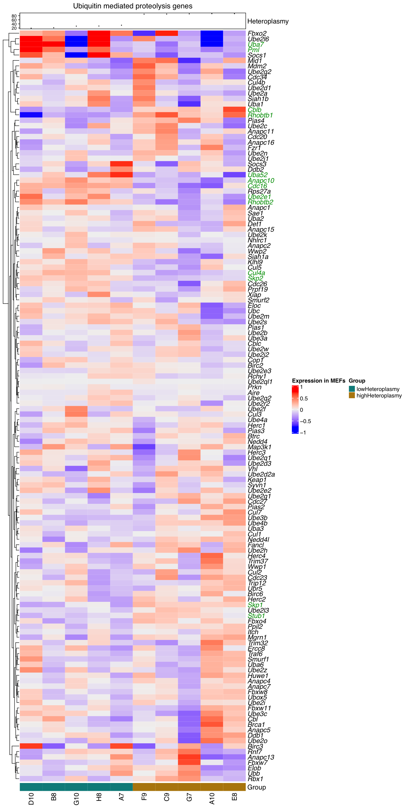
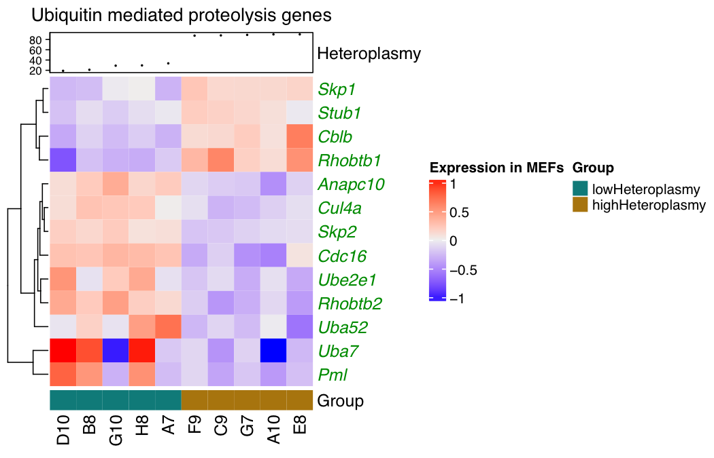
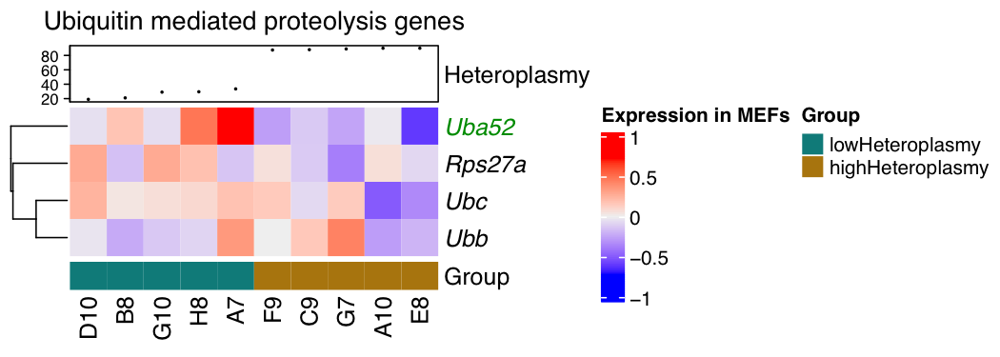
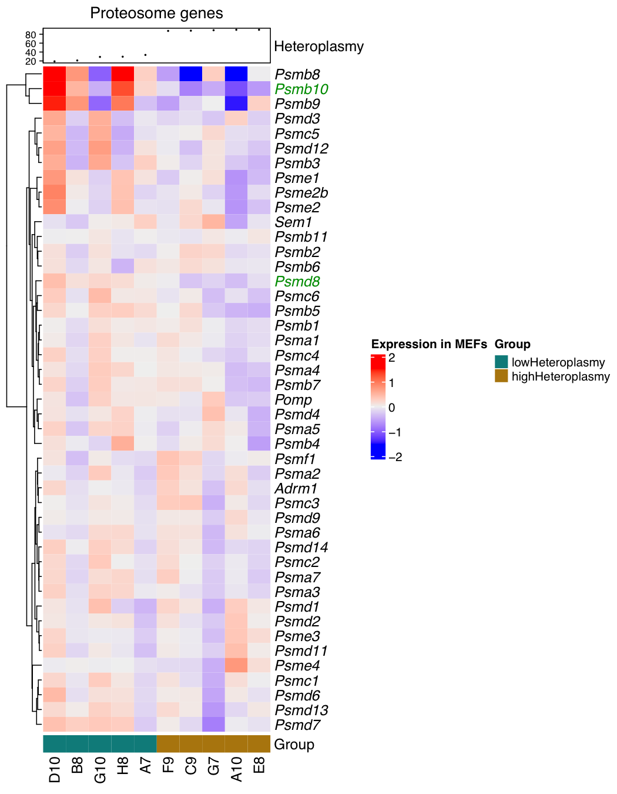
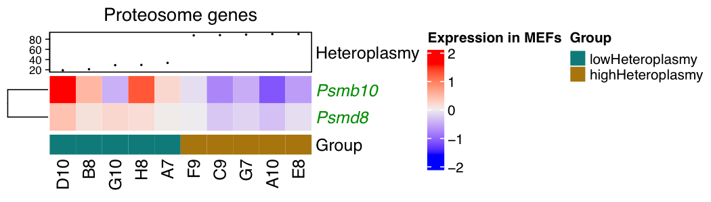

# MBU_mf671_001

### Project: Investigating ubiquitin mediated proteolysis transcriptomic changes in m.5024C>T high vs low heteroplasmy bulk RNA-seq in MEFs.

### Project owner: Michele Frison, Stephen Burr & Patrick Chinnery

### Analysis: Malwina Prater

### Abstract:

Mitochondrial DNA (mtDNA) mutations cause rare inherited diseases and accumulate throughout life in healthy individuals, contributing to the pathogenesis of common late-onset disorders. Most mutations are heteroplasmic, only affecting a proportion of molecules, and high percentage levels of a pathogenic mutation are required to cause a cellular phenotype and disease. There are currently no clinical treatments that reduce heteroplasmy levels in brain and liver which are particularly vulnerable organs. Here we show that suppressing the mitochondrial deubiquitinase USP30 reduces heteroplasmy levels in vivo by enhancing mitochondrial quality control through mitophagy. This inhibited the accumulation of mutant mtDNA in brain and liver during early life and reduced the transmission of a pathogenic mtDNA variant from mother to offspring. USP30 inhibition was found to restore healthy levels of mitochondrial ubiquitylation, impacted by a mitochondrial translation defect induced by the mouse m.5024C>T tRNAala mutation. High levels of heteroplasmy were found to induce a global slowdown in translation and a concomitant decrease in gene expression of the ubiquitin-proteasome system (UPS), thus revealing a previously unappreciated mechanism of adaptation to mtDNA stress resulting in a pathological suppression of mitochondrial quality control.

--------------------

### Results

Heatmap showing all ubiquitin mediated proteolysis genes for m.5024C>T high vs low heteroplasmy MEFs:

 

[Download PDF Version](Results/MBU_mf671_001__ComplexHeatmap_5024_MEFs__ubiquitin_mediated_proteolysis_genes_all_.pdf)

Heatmap showing differentially expressed ubiquitin mediated proteolysis genes for m.5024C>T high vs low heteroplasmy MEFs:

 

[Download PDF Version](Results/MBU_mf671_001__ComplexHeatmap_5024_MEFs__ubiquitin_mediated_proteolysis_genes_DEGs_.pdf)

Heatmap showing all ubiquitin genes for m.5024C>T high vs low heteroplasmy MEFs:

 

[Download PDF Version](Results/MBU_mf671_001__ComplexHeatmap_5024_MEFs__ubiquitin_genes_all_.pdf)

Heatmap showing all proteosome genes for m.5024C>T high vs low heteroplasmy MEFs:

 

[Download PDF Version](Results/MBU_mf671_001__ComplexHeatmap_5024_MEFs__proteosome_genes_all_.pdf)

Heatmap showing differentially expressed proteosome genes for m.5024C>T high vs low heteroplasmy MEFs:

 

[Download PDF Version](Results/MBU_mf671_001__ComplexHeatmap_5024_MEFs__proteosome_genes_DEGs_.pdf)

### Scripts

Script to reproduce the figures can be found here: [MBU_mf671_001_heatmaps.R](Scripts/MBU_mf671_001_heatmaps.R). 

