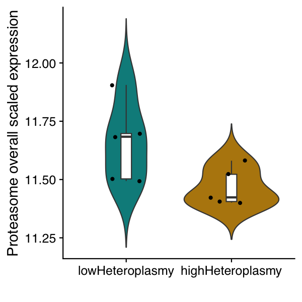
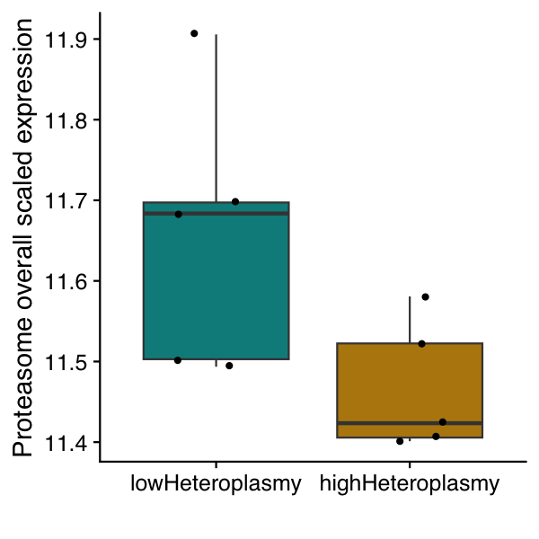

# MBU_mf671_001

### Project: Investigating ubiquitin mediated proteolysis transcriptomic changes in m.5024C>T high vs low heteroplasmy bulk RNA-seq in MEFs.

### Project owner: Michele Frison, Stephen Burr & Patrick Chinnery

### Analysis: Malwina Prater

### Abstract:

Mitochondrial synthesis of ATP is essential for eukaryotic life but is dependent on the co-operation of two genomes: nuclear and mitochondrial DNA (mtDNA). MtDNA mutates ~15-fold faster than the nuclear genome, challenging this symbiotic relationship. Mechanisms must have evolved to moderate the impact of mtDNA mutagenesis, but are poorly understood. Here, we observed purifying selection of a murine mtDNA mutation modulated by Ubiquitin-specific Peptidase 30 (Usp30) during the maternal-zygotic transition. In vitro, Usp30 inhibition recapitulated these findings by increasing ubiquitin-mediated mitochondrial autophagy (mitophagy). We also found that high mutant burden, or heteroplasmy, impairs the ubiquitin proteasome system, explaining how mutations can evade quality control to cause disease. Inhibiting USP30 unleashes latent mitophagy, reducing mutant mtDNA in high-heteroplasmy cells. These findings suggest a potential strategy to prevent mitochondrial disorders. 

--------------------

### Results

Heatmap showing all ubiquitin mediated proteolysis genes for m.5024C>T high vs low heteroplasmy MEFs:

 

[Download PDF Version](Results/MBU_mf671_001__ComplexHeatmap_5024_MEFs__ubiquitin_mediated_proteolysis_genes_all_.pdf)

Heatmap showing differentially expressed ubiquitin mediated proteolysis genes for m.5024C>T high vs low heteroplasmy MEFs:

 

[Download PDF Version](Results/MBU_mf671_001__ComplexHeatmap_5024_MEFs__ubiquitin_mediated_proteolysis_genes_DEGs_.pdf)

Heatmap showing all ubiquitin genes for m.5024C>T high vs low heteroplasmy MEFs:

 

[Download PDF Version](Results/MBU_mf671_001__ComplexHeatmap_5024_MEFs__ubiquitin_genes_all_.pdf)

Heatmap showing all proteosome genes for m.5024C>T high vs low heteroplasmy MEFs:

 

[Download PDF Version](Results/MBU_mf671_001__ComplexHeatmap_5024_MEFs__proteosome_genes_all_.pdf)

Heatmap showing differentially expressed proteosome genes for m.5024C>T high vs low heteroplasmy MEFs:

 

[Download PDF Version](Results/MBU_mf671_001__ComplexHeatmap_5024_MEFs__proteosome_genes_DEGs_.pdf)

Overall proteasome transcription was measured using mean scaled expression of all proteasome genes for each sample/clone to reflect on direction of change and avoid biases introduced by highly expressed genes. Below are boxplot and violin plot showing proteasome module expression in low and high heteroplasmy clones:

 

 

### Scripts

Script to reproduce the figures can be found here: [MBU_mf671_001_heatmaps.R](Scripts/MBU_mf671_001_heatmaps.R). 

